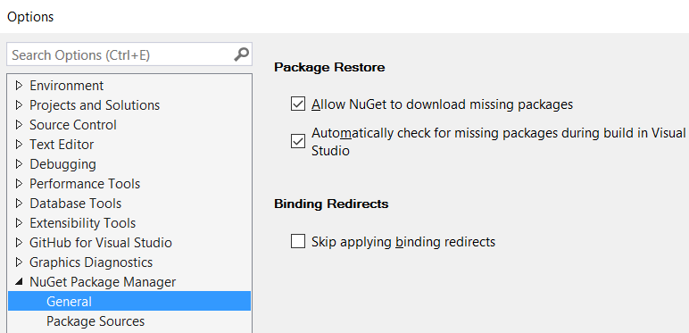
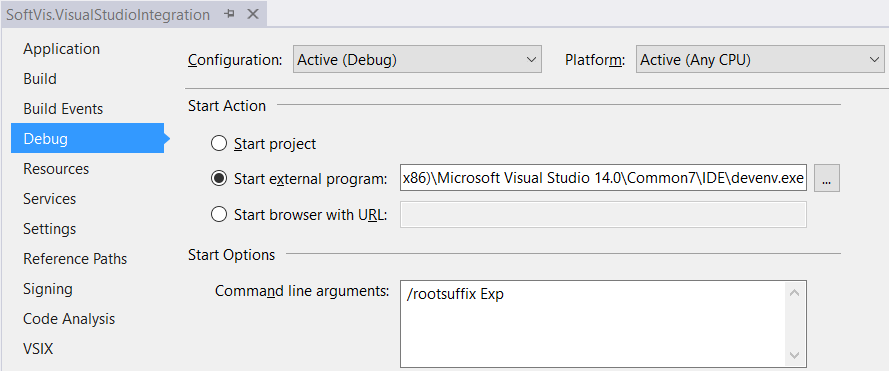

# How to contribute

## How to build the source
1. Prerequisites
   * Visual Studio 2015 Update 3 (any edition)
   * [Visual Studio 2015 SDK Update 3](https://msdn.microsoft.com/en-us/library/mt683786.aspx)
   * [NsDepCop 1.5](https://nsdepcop.codeplex.com/releases/view/624331) (for enforcing namespace dependency rules)
1. [Download or clone the source](https://github.com/realvizu/QuickDiagram)
1. Open "source\QuickDiagramTool.sln"
1. Enable NuGet Package restore in Visual Studio

1. Build the solution

## How to debug the tool in Visual Studio
1. In the SoftVis.VisualStudioIntegration project set up debug start action.
   * StartProgram: C:\Program Files (x86)\Microsoft Visual Studio 14.0\Common7\IDE\devenv.exe
   * StartArguments: /rootsuffix Exp 

1. Set SoftVis.VisualStudioIntegration as StartUp project.
1. Run the solution.
