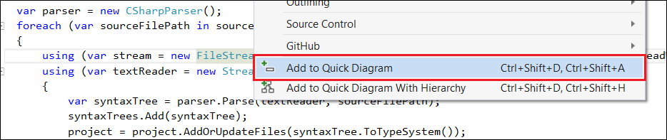
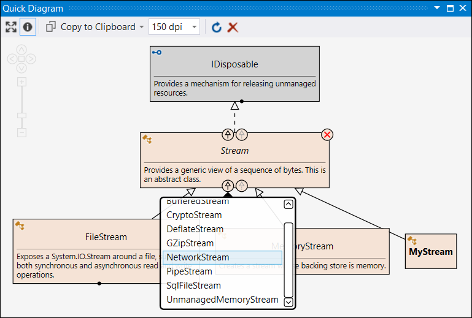

# Quick Diagram Tool for C# #

Code visualization tool for C# to quickly **explore, navigate and document** source code structure and relationships. 
Integrates into Visual Studio 2015.
Similar to the Code Map feature of Visual Studio Enterprise Edition but more lightweight ... and free.

**Explore code visually**
* Add types or entire hierarchies from source code to diagram to visualize their relationships.
* Use the diagram to discover related types.

**Navigate quickly**
* Jump from the diagram to relevant source code segments.

**Document with diagrams**
* Copy/paste diagrams into documentation.
 

<!-- Update the VS Gallery link after you upload the VSIX-->
<!-- Download this extension from the [VS Gallery](https://visualstudiogallery.msdn.microsoft.com/[GuidFromGallery])
or get the [CI build](http://vsixgallery.com/extension/7481ead5-87e4-4ac0-86d1-317e7adab60c/). -->

## Getting Started
* Use the context menu in the source code editor to add types or entire hierarchies to the diagram.

* Use existing diagram nodes to discover their related entities. Dots on the sides of the diagram rectangles show that related entities exist.

* Double-click on diagram nodes to jump to their declaration in the source code.
* Save diagrams as image or copy/paste them directly into documentation.

See the [**Help**](Help.md) for details.

## Versions
See the [**Change Log**](CHANGELOG.md) for versions and road map.

The current version (v0.5) is an **experimental release** to showcase the approach of the tool. It supports only a few types of relationships: type inheritance and interface implementation. Later versions will show a lot more (namespaces, type members, method calls, property read/write, object creation, etc.)

## Feedback
Please use the [**Issue Tracker**](https://github.com/realvizu/QuickDiagram/issues) to record bugs and feature requests.

**Your feedback is much appreciated and is very important to shape the future of this tool!**
In other words: I won't put any more effort into it if I don't get some positive feedback :)

To keep informed about my hobby projects follow me on twitter [@realvizu](https://twitter.com/realvizu)

## Thanks to 
* [Roslyn](https://github.com/dotnet/roslyn) for the best parser API.
* [QuickGraph](https://quickgraph.codeplex.com/) for the great graph library.
* [Graph#](http://graphsharp.codeplex.com/) for inspiration about WPF diagram canvas implementation and graph layout algorithms.
* [LearnVSXNow](https://learnvsxnow.codeplex.com/) for VSIX resources.
* [Extensibility Tools](https://marketplace.visualstudio.com/items?itemName=MadsKristensen.ExtensibilityTools) for helping a lot in VSIX authoring.

## License
[GPL-2.0](LICENSE)
